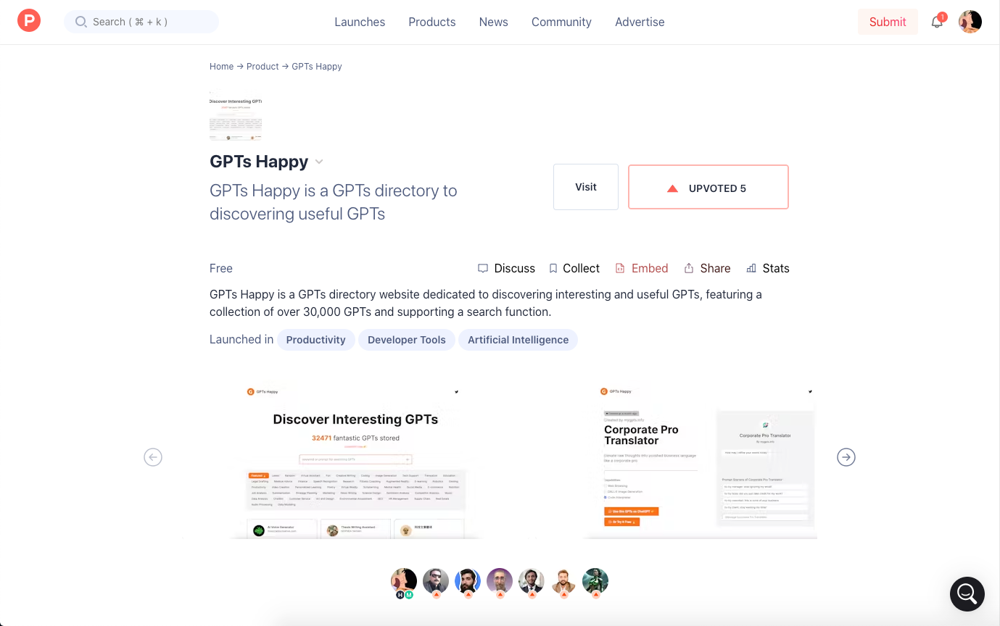
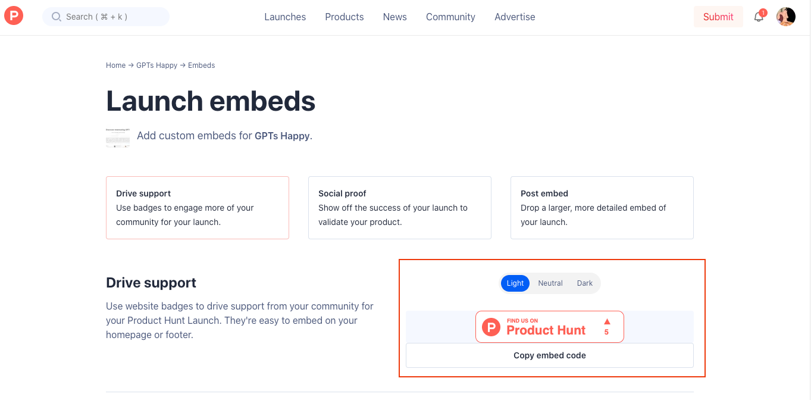
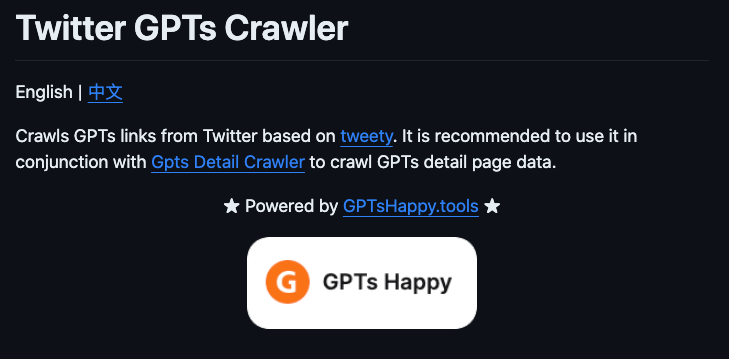
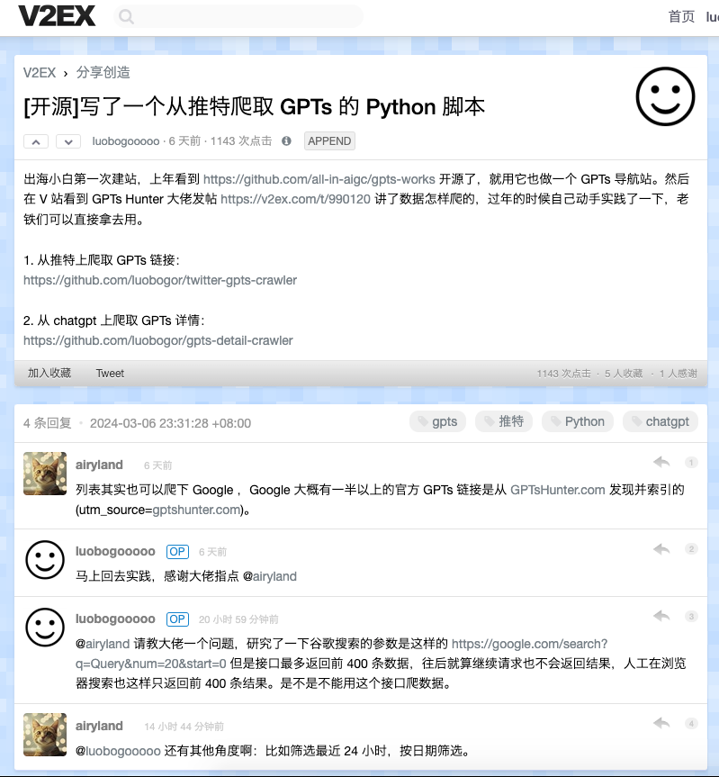
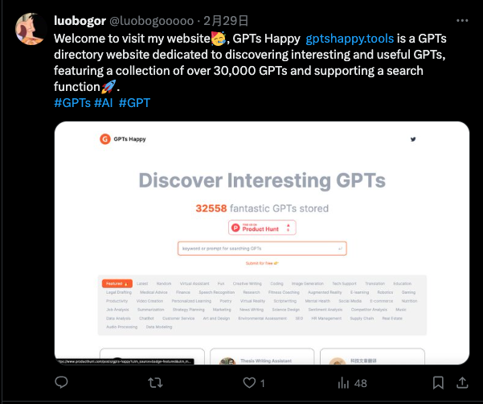
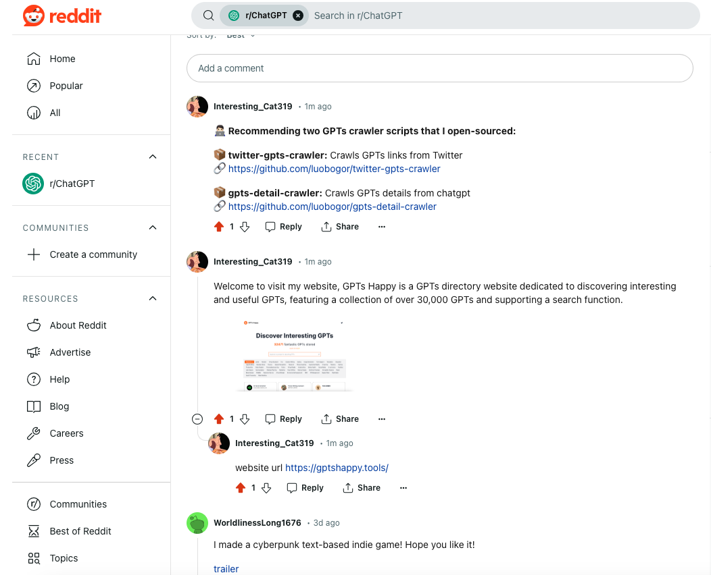
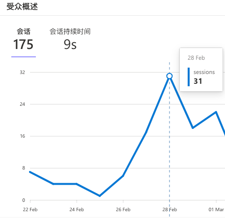
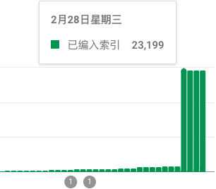

## 流量分析
准备网站推广工作，第一步先接入流量统计，方便我们日后统计不同渠道的流量来源。调研了一下有三个选择：

1. Goggle Analytics 4，免费，功能强大。
2. Microsoft Clarity，免费，接入非常简单，功能没 GA4 强大，可以与 GA4 数据联动。
3. [Plausible Analytics](https://plausible.io?utm_source=luobogor.github.io)，使用非常简单，功能强大，用户体验好，收费，但可以免费体验一个月。

GA4 与 Clarity 各有各的优点，而且两个都是免费的，都接入就对了。先接 GA4，推荐阅读[这篇文章](https://xn--5hq58jg23b.com/ga4%E5%AE%89%E8%A3%85%E5%92%8C%E5%9F%BA%E7%A1%80%E8%AE%BE%E7%BD%AE%E6%95%99%E7%A8%8B?utm_source=luobogor.github.io)接入。然后 Clarity 关联 GA4 数据，推荐阅读[这篇文章](https://xn--5hq58jg23b.com/%E5%BE%AE%E8%BD%AFclarity%E6%95%99%E7%A8%8B?utm_source=luobogor.github.io)接入。一套组合拳打下来，一个字赞！

## 网站推广
### Product Hunt
说一些踩过的坑，[Product Hunt](https://www.producthunt.com) 注册后要经过一周后才能提交自己产品。注册的时候资料要尽可能完善，注册后也要多活跃活跃，关注一些人，关注一些产品。否则过一周后你会发现自己依然提交不了产品。最终成功提交了 [GPTs Happy](https://www.producthunt.com/posts/gpts-happy)。

提交成功后你就可以将自己的产品分享到各种社交平台拉票了，还可以将产品投票按钮放到自己的网站。

### Github
Github 主要利用开源的方式引流，把自己写的两个爬虫脚本开源出来：

1. [从推特上爬取 GPTs 链接](https://github.com/luobogor/twitter-gpts-crawler)
2. [从 ChatGpt 上爬取 GPTs 详情](https://github.com/luobogor/gpts-detail-crawler)

然后在使用说明中加上自己的网站链接，这样别人使用你的脚本的时候就会知道你的网站了。 

### V2EX
[V2EX]((https://v2ex.com) 是一个非常活跃的技术社区，也是我最喜欢的中文技术社区。你可以在创意区上推广自己的产品，我主推的还是[爬虫脚本](https://v2ex.com/t/1019607#reply4)，顺便请教了 [GPTs hunter](https://www.gptshunter.com?utm_source=luobogor.github.io) 作者一波，感谢感谢。

### X(Twitter)
平时一些有用的小知识可以在 X 上分享，没事发发推，唠嗑唠嗑，慢慢积粉。这是[我的推](https://twitter.com/luobogooooo)。

### Reddit
[Reddit](https://www.reddit.com) 有个 [ChatGPT](https://www.reddit.com/user/hi_there_bitch/?rdt=56488) 频道，每周有个帖子给大家打广告用，可以在这里发布自己的 AI 产品。 这个频道有 460 万人关注，时刻都有上千人在线，发就完了。

### 其他方式
推广方式还有非常多，比如 Facebook、Hacker News、到阮一峰科技周刊、Hello Github 周刊、AI 导航站提交自己的网站等等。这里就不一一列举了。

## 推广效果
2 月 28 日那天涨了一波访问量（虽然非常少🤣）。

意外收获，也是 2 月 28 日那天 Google 收录突然暴增，由原来 1k 暴增到 2w，可能是因为外链增多的缘故，网站权重变大了。 

