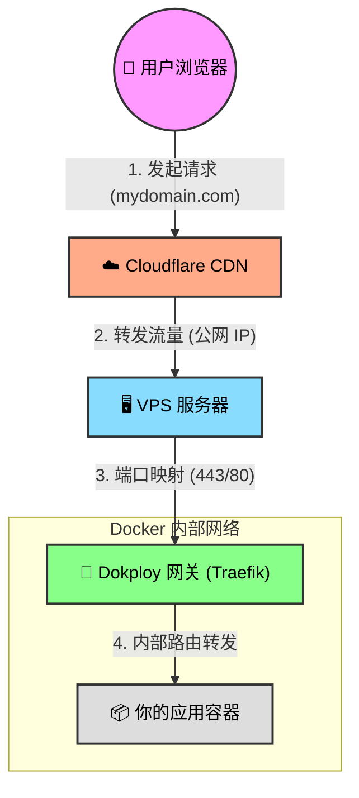

本文带你了解流量如何从 CloudFlare 到 Dokploy 应用容器。下图展示了请求的完整生命周期：

**流程详解：**

1.  **用户发起请求**：
    用户在浏览器输入域名，请求首先到达离用户最近的 **Cloudflare 边缘节点**。此时，Cloudflare 作为第一层代理，负责接收用户的连接。

2.  **Cloudflare 转发**：
    Cloudflare 根据 DNS 设置，将请求通过公网转发给你的 **VPS 服务器 IP**。

3.  **VPS 接收与映射**：
    流量到达 VPS 后，操作系统根据防火墙规则，将访问 80 (HTTP) 或 443 (HTTPS) 端口的流量，直接映射给正在监听这些端口的 **Dokploy 网关容器 (Traefik)**。

4.  **Traefik 内部路由**：
    Traefik 是 Dokploy 的核心“交通指挥官”。它收到请求后，会检查请求的域名（Host），并在 Docker 内部网络中找到对应的 **应用容器**（比如你的 Next.js 或 Java 服务），最后将请求精准地送达应用内部。
