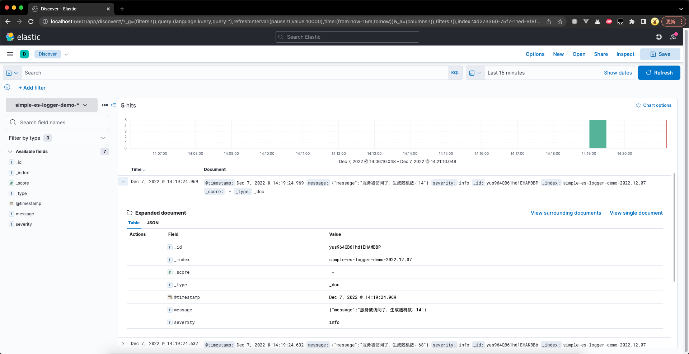
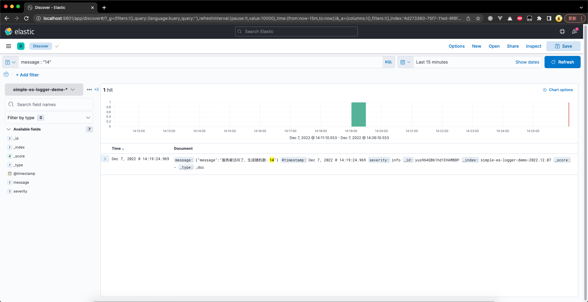
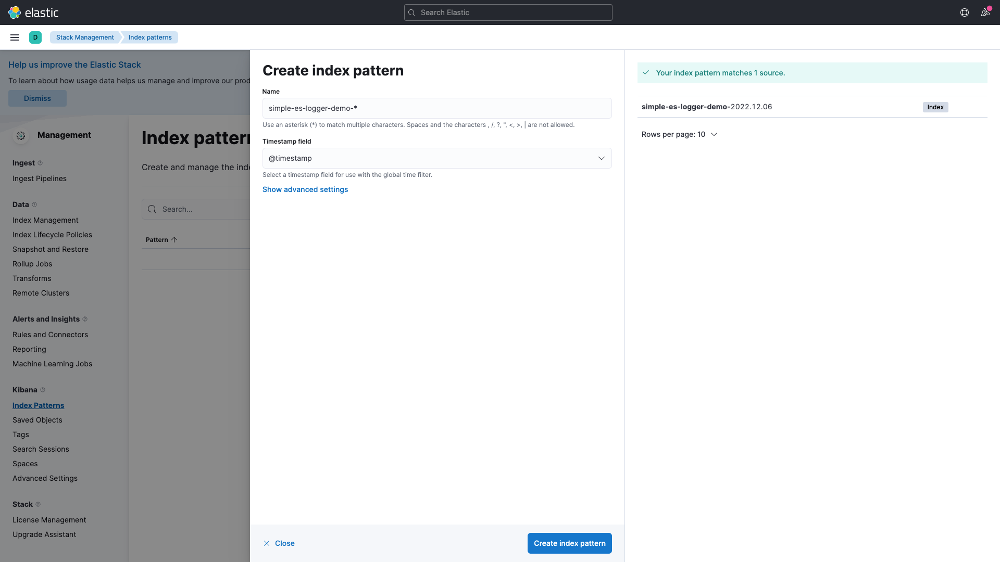

## 背景
应用日志一般做法，Filebeat 从文件收集日志做日志过滤、清洗，发送到 Kafka 削峰处理，Logstash 从 Kafka 读取日志发送到 ES。应用日志，日志量也不大，Node 直接将日志存储到 ES，使用 Kibana 用可视化的方式进行 ES 查询日志。

Elasticsearch 有多个版本，本文以 7.17 为例进行讲解。

## 安装
下面涉及到安装的步骤都以 MacOS 为例进行讲解，其他操作系统可以参考 [《Set up Elasticsearch》](https://www.elastic.co/guide/en/elasticsearch/reference/7.17/targz.html) 进行操作。

参考 ES 文档 https://www.elastic.co/guide/en/elasticsearch/reference/7.17/brew.html，执行以下命令安装 Elasticsearch

```shell
brew tap elastic/tap
brew install elastic/tap/elasticsearch-full
```

安装完成后，执行控制台执行 `elasticsearch` 命令启动 ES，启动后如何能正常访问 [http://localhost:9200](http://localhost:9200) 表示启动成功。

```shell
$ curl http://localhost:9200
{
  "name" : "jinzhanyedeMacBook-Pro.local",
  "cluster_name" : "elasticsearch_jinzhanye",
  "cluster_uuid" : "U4ob5U_CQXifCe_FgI183A",
  "version" : {
    "number" : "7.17.4",
    "build_flavor" : "default",
    "build_type" : "tar",
    "build_hash" : "79878662c54c886ae89206c685d9f1051a9d6411",
    "build_date" : "2022-05-18T18:04:20.964345128Z",
    "build_snapshot" : false,
    "lucene_version" : "8.11.1",
    "minimum_wire_compatibility_version" : "6.8.0",
    "minimum_index_compatibility_version" : "6.0.0-beta1"
  },
  "tagline" : "You Know, for Search"
}
```

执行以下命令安装 Kibana。

```shell
$ brew tap elastic/tap
$ brew install elastic/tap/kibana-full
```

安装完成后，并确定 Elasticsearch 已经启动成功后，控制台执行 `kibana` 命令启动 Kibana。启动后如何能正常访问 [http://localhost:5601](http://localhost:5601) 表示启动成功。


至此我们已经环境搭建完毕，在进入下一小节之前如果之前没有接触过 ES，可以看看阮老师的文章 [《全文搜索引擎 Elasticsearch 入门教程》](https://www.ruanyifeng.com/blog/2017/08/elasticsearch.html) 简单了解一下，有利于消化后面的内容。阮老师文章里提到的命令也可以在 [Kibana Dev Tools](http://localhost:5601/app/dev_tools#/console) 执行，内容被格式化后阅读体验更佳。


## Node 日志上报到 ES  
Node 日志上报到 ES 参考这个 [Demo](http.baidu.com)，我们使用 [winston](https://www.npmjs.com/package/winston) 收集日志，使用 [winston-elasticsearch](https://www.npmjs.com/package/winston-elasticsearch) 上报日志到 ES。winston-elasticsearch 每天新建一个命名为 simple-es-logger-demo-YYYY.MM.DD 的 index。

```js
/**
 * es-logger.js
 */

const { createLogger: createWinstonLogger, transports, format } = require('winston')
const { ElasticsearchTransport } = require('winston-elasticsearch')

const esNode = 'http://localhost:9200'

function createLogger() {
  return createWinstonLogger({
    level: 'info',// 只上报 info 级别以上日志，包括 info、warn、error
    transports: [
      new transports.Console({// 输出到控制台
        format: format.json(),
      }),
      new ElasticsearchTransport({// 输出到 ES
        indexPrefix: 'simple-es-logger-demo',// ES index 前缀
        indexSuffixPattern: 'YYYY.MM.DD',// ES index 后缀，跟前缀拼接起来 index 最终就是 simple-es-logger-demo-YYYY.MM.DD，如 simple-es-logger-demo-2023.01.12
        clientOpts: {
          node: esNode,
          maxRetries: 5,
          requestTimeout: 10000,
          sniffOnStart: false,
        },
      })
    ]
  })
}

module.exports = createLogger()
```

> Compatibility For Winston 3.7, Elasticsearch 8.0 and later, use the >= 0.17.0. For Winston 3.4, Elasticsearch 7.8 and later, use the >= 0.16.0. For Winston 3.x, Elasticsearch 7.0 and later, use the >= 0.7.0. For Elasticsearch 6.0 and later, use the 0.6.0. For Elasticsearch 5.0 and later, use the 0.5.9. For earlier versions, use the 0.4.x series.

这里版本的问题需要注意，我们使用的是 ES 7.17，从 `winston-elasticsearch` 的文档可以得知，`winston` 需要选择 3.4 版本， `winston-elasticsearch` 需要选择 >= 0.16.0 的版本。

```json5
// package.json
"dependencies": {
  "koa": "^2.5.2",
  "winston": "3.4.0",
  "winston-elasticsearch": "0.16.1"
},
```

接着我们用 Koa 搭建一个简单的服务。

```js
/**
 * index.js
 */

const Koa = require('koa')
const app = new Koa()
const logger = require('./es-logger')


app.use(async (ctx, next) => {
  const body = {
    message: `服务被访问了，生成随机数：${ Math.floor(Math.random() * 100) }`
  }

  logger.info(JSON.stringify(body))

  ctx.body = body

  next()
})

const port = 7115

app.listen(port, () => {
  console.log(`服务启动成功，http://localhost:${7115}`)
})
```

访问 [http://localhost:7115](http://localhost:7115)，控制台输出如下。

```
$ curl http://localhost:7115
{"level":"info","message":"{\"message\":\"服务被访问了，生成随机数：67\"}"}
```

```
{
  "@timestamp": "2022-12-07T06:19:24.969Z",
  "message": "{\"message\":\"服务被访问了，生成随机数：14\"}",
  "severity": "info",
  "fields": {}
}
```



如果你的控制台没有报错说明日志已经上报到 ES，接下来我们看看如何使用 Kibana 查看我们上报的日志。`message: "14"`



## 使用 Kibana 查看日志
在首页左侧面板导航找到 Management -> Stack Management，点击进入 Stack Management。再在左侧导航找到 [Index Patterns](http://localhost:5601/app/management/kibana/indexPatterns)。Name 输入 simple-es-logger-demo-*，过滤以 `simple-es-logger-demo` 开头的 index。Timestamp field 选择 @timestamp



## 封装 SDK
那么我们该如何封装一个优雅的 SDK (打广告时间滑稽)

- 请求中间件：自动记录每个请求、响应信息
- 性能问题：非 Serverless 环境先缓存日志，每 30s 上报一次
- Serverless 环境支持：我们团队有些项目已经迁移到 Serverless 环境部署
- 更好的 API 体验：使用 xxx 保证 json 安全，error 格式化

```
${timestamp} ${logLevel} ${pid} [${userId}/${ip}/${traceId}/${cost}ms ${method} ${url}] ${message}
```

- @za-node/express-logger:
- @za-node/koa-logger:
- @za-node/egg-framework:


## 参考
- [Elasticsearch 官方文档](https://www.elastic.co/guide/en/elasticsearch/reference/7.17/targz.html)
- [全文搜索引擎 Elasticsearch 入门教程](https://www.ruanyifeng.com/blog/2017/08/elasticsearch.html)
- [winston](https://www.npmjs.com/package/winston)
- [winston-elasticsearch](https://www.npmjs.com/package/winston-elasticsearch)

---

欢迎关注我的公众号 Luobo FE，获取最新资讯动态🔥


