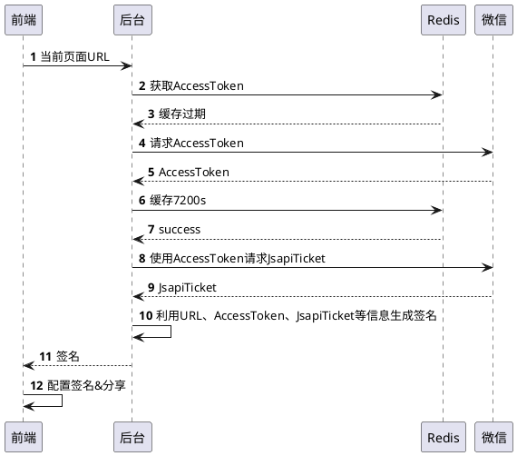

## 前言
H5 分享到微信朋友圈、好友，Tab 添加图片和描述是一个常见的需求，微信提供了 JSSDK 来帮助我们实现这个功能。本文将详细讲解如何接入微信 JSSDK，包括签名校验、公众号配置、功能开发、开发调试、常见问题等等。嫌文章太长可以直接把[开源项目](https://github.com/luobogor/wxjssdk-share-demo)领走😏。


## wxjssdk 接入流程
查看[微信 JS-SDK 说明文档](https://developers.weixin.qq.com/doc/offiaccount/OA_Web_Apps/JS-SDK.html#62)可以知道，对于前端页面来说配置微信分享信息并不复杂，引入 JSSDK 后先配置签名验证信息。


再调用 API 就可以。


但难点有以下几个：
1. 如何生成签名信息
2. 公众号一系列繁琐的安全配置
3. 避免真机调试的繁琐，如何在电脑上调试分享效果
   下面一一详细讲解如何解决这些问题。

## 签名校验
### 为什么要签名？
微信方不想要让所有的人都去访问它的接口，为了确保请求源的合法性需要签名校验。

### 签名流程
根据 [JS-SDK 使用权限签名算法](https://developers.weixin.qq.com/doc/offiaccount/OA_Web_Apps/JS-SDK.html#62)得知，签名流程如下：
1. 请求微信服务获取公众号临时 access_token（需缓存 7200s）
2. 使用 access_token 换 jsapi_ticket（需缓存 7200s）
3. 使用当前页面url、jsapi_ticket、timestamp、noncestr（随机数） 按照规定算法生成签名

这些流程都有开源库帮我们做好封装，我们直接拿来用就好，后面具体代码实现讲到。

## 公众号配置
在进行开发前我们需要先需要进行公众号配置

### 安全域名配置
进入公众号设置 -> 功能设置，设置 JS 接口安全域名、业务域名。


- 设置JS接口安全域名后，公众号开发者可在该域名下调用微信开放的JS接口。
- 设置业务域名后，在微信内访问该域名下页面时，不会被重新排版。用户在该域名上进行输入时，不出现安全提示。
  

把 MP_verify_xxx.txt 文件部署到你的项目，确保「项目域名/MP_verify_xxx.txt」这个地址可以访问，然后点击保存。


Vue 项目放到 public 目录就可以。


### 服务白名单配置
进入「基本配置」，把后台服务 IP 填到 IP 白名单，否则不能请求微信服务进行获取 access_token 等操作。


### 开发者工具配置
绑定开发者配置，否则开发者工具不能打开该公众号的页面进行调试。点击「开发者工具」->「Web开发者工具」。


点击「绑定开发者微信号」。


## 功能开发
### 时序图


[PlantUML Web Server](https://www.plantuml.com/plantuml/uml/SoWkIImgAStDuKeiBSdFAyrDIYtYUjhP-tprUWLTEuMd4_gUzc-mKdYwTp9GyEN2hI_dBWeDyk62Y8DK1AMcP1PRARpes_wqVvfZSd9gSN58VdPg7XTOGa4NoP3dUoO_NJlZnVxsPtFc8vdmTD-w9_iN0erOl_tPnYPa8o0oA6OWIQCx0cQ1kP61GJ4MwujBmNeHsX2-wrZvVCeAeByUDpGYMV1yRIVG-cUDwvzFcV-iOyBpjVkUJkY5QmVgXuIJbG941Xvi28cNhRtFzww3IAizxMXxicir5vT3QbuACC01)


### Node.js 后台

我们核心用到的库是 [wechat-api](https://github.com/node-webot/wechat-api)，它为我们封装好了生成签名的方法。

```javascript
/**
 ** /utils/wechat-api-hub
 **/

const config = require('config');
const WechatAPI = require('wechat-api');
const Redis = require('./redis');
const Helper = require('./helper');

function getWechatKey(type) {
  return 'NODE_WECHAT_' + (type || 'DEFAULT_TYPE').toUpperCase();
}

const TOKEN_KEY = getWechatKey('TOKEN')

/**
 * 将存储在 Redis 的原始信息，解析为 JSON，并在本地将到期时间随机提前，避免各节点同时到期、同时刷新
 *
 * @param {String} rawData - 原始数据
 * @return {Object}
 */
function parseRawData(rawData) {
  const data = Helper.parseJSON(rawData)
  if (!data) {
    return data
  }

  return {
    ...data,
    // 因为 wechat-api 内部已经提前 10 秒，所以此处最多提前 50 秒，合计最多提前 1 分钟
    expireTime: data.expireTime - Math.round(Math.random() * 50 * 1000),
  }
}

const wechat = new WechatAPI(
  config.get('wechat.id'), // 开发者 ID
  config.get('wechat.secret'), // 开发者 Secret
  // 获取 token
  function getToken(callback) {
    Redis.get(TOKEN_KEY, function (err, rawData) {
      callback(err, parseRawData(rawData))
    });
  },
  // 缓存 token
  function saveToken(token, callback) {
    // 根据文档要求缓存 7200 秒
    Redis.set(TOKEN_KEY, JSON.stringify(token), 'EX', 7200, callback);
  }
);

wechat.registerTicketHandle(
  // 获取 ticket
  function getTicket(type, callback) {
    Redis.get(getWechatKey(type), function (err, rawData) {
      const data = parseRawData(rawData)
      callback(err, data)
    });
  },
  // 缓存 ticket
  function saveTicket(type, ticket, callback) {
    Redis.set(getWechatKey(type), JSON.stringify(ticket), 'EX', 7200, callback);
  }
);

module.exports = {
  wechat,
};
```

开发者 ID 和 Secret 在公众号后台「基本配置」获取 。


我们需要在 saveToken 回调缓存 access_token，然后在 getToken 返回。**生产环境一般会部署多个节点，所以还是得用 Redis 去缓存 access_token，access_token 只能有一个，如果每个节点都缓存 access_token 到本地，新的 access_token 会使得其他节点的 access_token 失效。同理，如果生产环境、测试环境共用一个公众号，得统一使用一个 Redis，目前我们是统一使用生产的服务，测试环境测试完成后就禁用签名服务。长期项目还是建议生产环境、测试环境分开两个公众号，可以避免很多问题。**
再看下 API 入口，我们调用 wechat-api 的 [getJsConfig](https://doxmate.cool/node-webot/wechat-api/api.html#api_js_exports_getJsConfig) 方法，传入用于签名的 url 就可以生成签名配置。

```javascript
/**
 ** /server.js
 **/

const Koa = require('koa');
const Router = require('koa-router');
const config = require('config');
const WechatAPI = require('./utils/wechat-api-hub').wechat;

const app = new Koa();
const router = new Router();

router.get('/api/jsconfig', async (ctx) => {
  const url = decodeURIComponent(ctx.request.query.url);

  const result = await new Promise(function (resolve, reject) {
    WechatAPI.getJsConfig({
      url // 签名的 url
    }, function (err, jsConfig) {
      if (err) {
        return reject(err);
      }

      resolve({
        ...jsConfig,
        // 以下配置在前后端写都可以
        debug: false,
        jsApiList: [// 声明需要使用到的 API
          'updateAppMessageShareData', // 分享到微信聊天
          'updateTimelineShareData',// 分享到朋友圈
        ]
      })
    })
  })

  // 设置响应体为 JSON 数据
  ctx.response.type = 'application/json';

  ctx.body = {
    data: result,
  };
});

app.use(router.routes()).use(router.allowedMethods());

const port = config.get('port');
app.listen(port, () => {
  console.log(`Server is running at http://localhost:${port}`);
});
```

### 前端
前端代码如下：

```html
<!-- 引入 jssdk -->
<script src="/jweixin-1.6.0.js"></script>
<script>
// 去掉 URL #及后面的部分
const validateUrl = location.href.split('#')[0]

const jsconfig = await fetch(`serverhost/api/jsconfig?url=${encodeURIComponent(validateUrl)}`) // 请求服务获取 js 配置

wx.config(jsconfig);

wx.ready(function () {   // 需在用户可能点击分享按钮前就先调用
  wx.updateAppMessageShareData({ // 分享到微信聊天
    title: '', // 分享标题
    desc: '', // 分享描述
    link: validateUrl, // 分享链接，该链接域名或路径必须与当前页面对应的公众号JS安全域名一致
    imgUrl: '', // 分享图标
    success: function () {
      // 设置成功
    }
  })
  
  wx.updateTimelineShareData({ // 分享到朋友圈
    title: '',
    link: validateUrl,
    imgUrl: '',
    success: function () {}
  })
  
}); 
</script>
```

需要注意以下几点：
1. 对于传给后台的签名链接，得处理好，不要包含#及其后面部分。
   
2. 验证链接的域名必须与当前链接一致。如下图，当前页面链接与验证链接不一致，验证不通过。
  1. ✅当前链接 `http://www.example.com/`，验证链接 `http://www.example.com/`
  2. ❌当前链接 `http://www.example.com/?name=luobogor`，验证链接 `http://www.example.com/`
  3. ❌当前链接 `http://www.example.com/`，验证链接 `http://www.example.com`
    
3. 分享链接可以不是当前页面，但域名必须是已经配置在公众号JS安全域名。比如，A、B 域名都在同一个公众号配置了JS安全域名，A 域名分享 B 域名的链接也是可以的。

### 开发调试 Charles 代理配置
功能开发完成后，怎样在本地调试呢？因为涉及到当前页面域名签名验证，所以我们需要使用代理工具将域名/链接代理到本地服务。代理如下：

```plaintext
前端
http://example.com -> http://127.0.0.1:3111（你的前端项目端口） 

后端
http://example.com/api/jsconig -> http://127.0.0.1:3112（你的后端项目端口）
```

接下来演示如何用 Charles 做代理。开发期间最好使用 http，用 https 还要在 Charles 配证书，增加配置难度。以下以 http 协议域名为例，讲解 Charles 代理配置。

打开 Charles，工具栏上点击 Tools -> Map Remote，打开 Map Remote Settings，如下面所示，把前后端两个代理配置加上即可。

前端页面代理配置：


后端 API 代理配置：


微信开发者工具默认不走 Charles 代理，需要进行配置，点击设置 -> 代理设置 -> 手动设置代理，填写 127.0.0.1:8888，Charles 默认端口是 8888


这样我们输入 http://example.com 就可以访问本地的前端项目，然后让前端项目请求 http://example.com/api/jsconig 获取签名信息，就可以请求本地的后端项目。点击右上角「...」，再点击分享到朋友圈，如果配置成功就能看到配置的信息了。


此外，方便调试可以还可以配置 `debug: true` ，微信相关 API 返回值都会在页面 alert 出来。


## 常见问题
在微信直接打开链接，分享成功回调了，但是配置还是不生效？根据微信政策，非直接打开的方式才可以进行分享配置，比如扫码打开、从收藏入口打开等。如下图所示，直接打开链接是无法配置分享的。


## 参考
- [微信 JS-SDK 说明文档](https://developers.weixin.qq.com/doc/offiaccount/OA_Web_Apps/JS-SDK.html#62)

