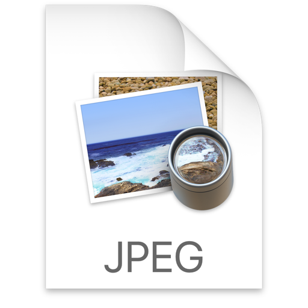

公司项目需要用到绘图框架，绘图部分以前是另一位同事负责，用的是 jsPlumb 框架。由于人员流动，后来这部分我接手了。项目绘图业务需求变得越来越复杂，jsPlumb 已经满足不了我们项目，于是我将目光投到了其他绘图框架。本文主要说说我在使用 jsPlumb 遇到的问题，以及我为什么选择 mxGraph。

## jsPlumb
jsPlumb 有社区版跟收费版，我们使用的是社区版，下面提到的问题在收费版不一定存在。

1. 不稳定
1. 没有内置导航器(收费版是有这个功能的)
1. 没有智能布局功能
1. 没有做图层管理
1. 没有集成截图功能
1. 画布没有边界自动扩充功能

- **不稳定：**
  主要体现在两点：
  1. 还原图形偶尔会报一些莫名其秒的错误，还原失败
  2. 连接线条偶尔会发生线条位置错乱的情况
  
  这可能是由于我使用 jsPlumb 不当引起的，又或者是框架本身存在问题，到最后都无法定位问题所在。但确实我在网上也看到有同学遇到过相似不稳定的情况。

- **没有内置导航器：**
  导航器为分两个功能：第一个是放大、缩小，第二是可拖拽改变视口的 minimap。对于放大、缩小这个功能，我们用 css scale 来对整个画布进行缩放。但这个方法的缺点很快就暴露了，缩放后节点位置会发生改变；至于 minimap 要实现的话无异于重复造轮子，团队资源有限，这个功能当时搁置了。

- **智能布局：**
  产品有一个需求是将用户 Excel 表中的数据用图形的方式展示，这就需要智能布局功能，不然程序不知道节点应该放置在什么地方才美观。实现这个功能要使用比较复杂的算法，团队资源有限，这个功能当时也搁置了。

- **没有做图层管理：**
  jsplumb 没有做图层管理，导致绘图过程中做不到一些想要的图层叠加效果，要做的话只能自己用 z-index 去控制，这无疑增加了项目维护成本。而且 jsPlumb 的靶点是通过绝对定位附着在节点上的，你需要管理的不仅仅是节点的 z-index 还有靶点的 z-index。

- **没有集成截图功能：**
  在用户绘绘图过程中做了任何改变图的外观的操作我们都需要对当前图形截图，然后同步到服务端作为该图形的封面。jsPlumb 没有内置的截图功能，我们使用 html2canvas 将 html 转换成 canvas 再转换成 png，然后发送到服务端。但 html2canvas 截图时会有1秒左右的卡顿，这降低了用户体验，并不是我们想要的。

- **画布没有边界自动扩充功能：**
  由于 jsPlumb 采用的是svg和html混排的做法，节点都是html，画布的边界自然是程序设定的 div 容器。节点多了或者用户想把节点拖远点都需要扩充画布边界，这又成了一个技术难题。当时我们只好用缓兵之计把画布写死成 5000 * 5000。
	

说了这么多 jsPlumb 的不好，我并没有黑这个框架的意思。毕竟 jsPlumb 现在的 start数、npm下载量都是绘图框架中最高的，肯定有它的过人之处，只是并不适合我们的项目。jsPlumb采用的是svg和html混排的做法，所有节点都是html，所有连线都是单独的svg节点包裹的path元素，对于高度定制化节点样式是非常方便的，我认为静态展示的图形非常适合使用 jsPlumb 绘制。

## mxGraph
基于以上提及到的种种原因，上年年末我做起了技术调研，希望能找到一个合适我们项目的绘图框架。目标非常明确，我要找的框架能帮助我解决上面所有的问题。一番谷歌筛选后，发现 mxGraph 跟 GoJS 都是能解决我们项目问题的，因为 GoJS 是闭源收费的，最后我选择了 mxGraph。

- **稳定性：**
  https://www.draw.io 是一个比较知名的开源绘图网站，就是用 mxGraph 进行开发的。这个绘图工具我偶尔也会使用，还试过出现 BUG 的情况。有 draw.io 当背书，我相信 mxGraph 的稳定性是靠得住的。

- **功能：**
  mxGraph 官方提供差不多 90 个例子，从这些例子跟 draw.io 中我可以确定我想要的功能 mxGraph 都可以帮助我实现。导航器、智能布局对于 mxGraph 来说只是一个 API 调用的事。mxGraph 的画布完全基于 svg，自定义节点样式，完全通过 js 完成，比较麻烦。但这对于 mxGraph 自身做图层管理是有好处的，对于开发都来说管理图形层叠也只是几个 API 的事，也不用管什么 z-index 了。由于画布完全基于 svg，不像 jsPlumb 用 html + svg 实现画布，所以 mxGraph 可以做到导出结构化的文档（XML），也不再需要使用 html2canvas 帮助截图，只需要调用几个接口导出当前文档发送给服务端，然后服务端通过 Java 版 (我们项目使用的是 Java，mxGraph 服务端环境还提供有 PHP、C#) mxGraph 将文档转换成图片，这样便解决了截图的问题。画布边界扩充也的问题也不用关心，mxGraph 已经帮助我们做了。再就是 draw.io 已经用 mxGraph 实现了复杂的绘图功能，相信即便以后我们的业务有更复杂的扩展这个框架也是能扛得住的。

- **社区：**
  mxGraph 在 stackoverflow https://stackoverflow.com/questions/tagged/mxgraph 上有虽然有 442 个左右相关问题，不过大多数都是回答数比较少，这是我当时比较担忧的一点。

- **兼容性问题：**
  项目对浏览器兼容性比较宽松，浏览器兼容性问题不在考虑范围之内。但交互上需要兼容iPad，从 mxGraph 的官方 Demo 中得知 mxGraph 对这方面有做兼容的，可以放心使用。

- **缺点：**
  - 文档不够友好(个人认为与GoJS文档水平差距甚远)，导致上手难度大
  - 没中文文档，英文不好的同学用起来有点吃力
  - 相对 jsPlumb 不能使用 css 自定义节点样式，完全通过 js 完成，比较麻烦

经过4个月使用后，确实 mxGraph 帮忙我们解决了上述问题。但同时也遇到的了一些问题，我们会在下一篇文章《mxGraph 入门实例教程》中指出。

## 参考
- 精读《12 个评估 JS 库你需要关心的事》https://zhuanlan.zhihu.com/p/45264866
- 前端可视化建模技术概览 https://leungwensen.github.io/blog/2015/frontend-visual-modeling.html

<section class="custom-bottom">
  欢迎关注 Luobo FE，更多精彩内容持续出炉🔥
</section>

